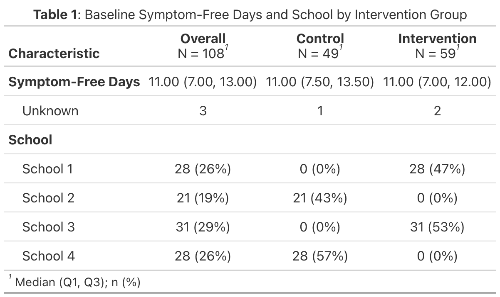

```{r setup, include=FALSE}

knitr::opts_chunk$set(echo = FALSE)

library(tidyverse)
library(ggplot2)

```


# I. Introduction 


# II. Methods

$$
SFD_{ijt} \sim \text{Beta-Binomial}(14,\; p_{ijt},\; \phi)
$$
$$
\text{logit}(p_{ijt}) = \beta_0 + \beta_1 \text{Time}_t + \beta_2 \text{Group}_j + \beta_3 (\text{Time}_t \times \text{Group}_j) + s_j + b_{ij}
$$
$$
s_j \sim N(0, \sigma^2_{\text{school}}, \quad
b_{ij} \sim N(0, \sigma^2_{\text{child}}), \quad
\text{logit}(\pi) = \gamma_0
$$


# III. Results


# IV. Discussion & Limitations


\newpage 

# V. Appendix 

**Table 1: Distribution of Memory Score by Study Day**. 

```{r, fig.align='center', out.width="6in", out.height = "4in"}



```


### References

1. Wagner, B., Riggs, P., & Mikulich-Gilbertson, S. (2015). The importance of distribution-choice in modeling substance use data: a comparison of negative binomial, beta binomial, and zero-inflated distributions. The American Journal of Drug and Alcohol Abuse, 41(6), 489–497. https://doi.org/10.3109/00952990.2015.1056447

2. Cohen, J. (1988). Statistical power analysis for the behavioral sciences (2nd ed.). Hillsdale,NJ: Lawrence Erlbaum.

3. Twisk JWR. Content. In: Applied Longitudinal Data Analysis for Medical Science: A Practical Guide. Cambridge University Press; 2023:vii-x.

4. Karla Hemming and Monica Taljaard. “Sample size calculations for stepped wedge and cluster randomised trials: a unified approach”. In: Journal of Clinical Epidemiology 69 (2016), pp. 137– 146. issn: 0895-4356. doi: https://doi.org/10.1016/j.jclinepi.2015.08.015.
